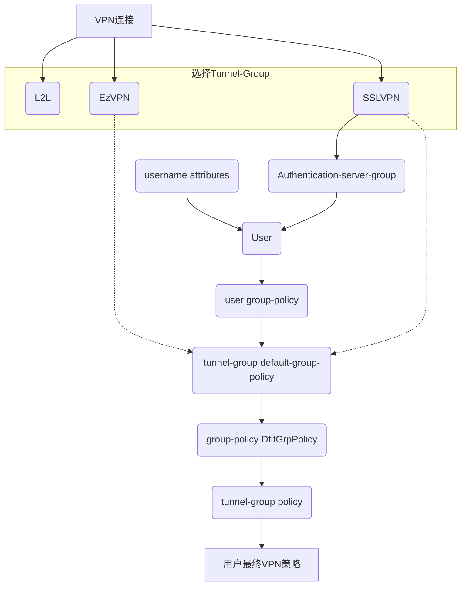

### ASA策略图




下面五个策略，越低越优先

- 策略优先级1：username attributes

```
username ssluser attributes
 vpn-framed-ip-address 1.2.3.4 255.255.255.0
```

- 策略优先级2：user group-policy

```
ip local pool POOL2 2.2.2.1-2.2.2.100
group-policy user-group-policy internal
group-policy user-group-policy attributes
 vpn-tunnel-protocol ssl-client ssl-clientless
 address-pools value POOL2
username ssluser attributes
 vpn-group-policy user-group-policy
```

- 策略优先级3：tunnel-group default-group-policy

```
ip local pool POOL3 3.3.3.1-3.3.3.100
group-policy tunnel-group-policy attributes
 address-pools value POOL3
tunnel-group anyconnect-tunnel-group type remote-access
tunnel-group anyconnect-tunnel-group general-attributes
 default-group-policy tunnel-group-policy
```

- 策略优先级4：group-policy DfltGrpPolicy

```
ip local pool POOL4 4.4.4.1-4.4.4.100
group-policy DfltGrpPolicy attributes
 address-pools value POOL4
```

- 策略优先级5：tunnel-group policy  

```
ip local pool POOL5 5.5.5.1-5.5.5.100
tunnel-group anyconnect-tunnel-group type remote-access
tunnel-group anyconnect-tunnel-group general-attributes
 address-pool POOL5
```


https://www.packetswitch.co.uk/cisco-asa-anyconnect-vpn/

